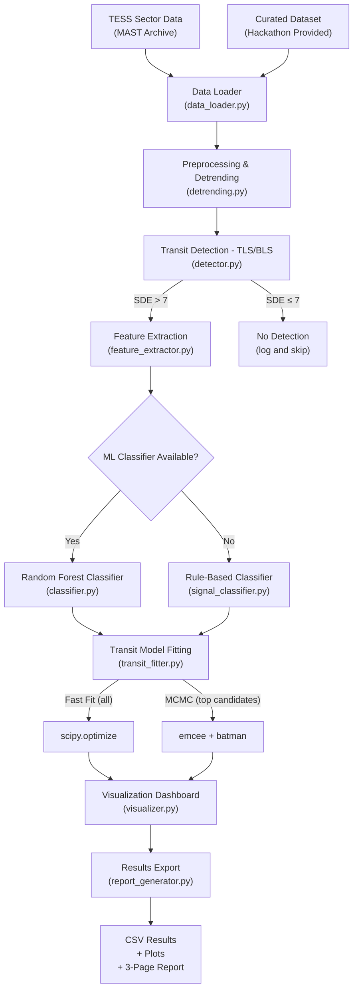

# ISRO BAH 2026 — Challenge 07: Exoplanet Transit Detection Pipeline

**Goal**: Transform the existing single-target TLS+rule-based pipeline into a hackathon-winning, production-grade AI system that robustly detects, classifies, and characterizes exoplanet transit signals from noisy TESS light curves.

## User Review Required

> [!IMPORTANT]
> **Scope Decision**: The plan below builds a complete end-to-end pipeline that runs on a single machine. It processes a full TESS sector (~20-30k light curves), trains an ML classifier, fits transit models with uncertainties, and generates publication-quality visualizations. This will require downloading ~2-5 GB of TESS data per sector and ~30-60 min of compute for a full sector run.

> [!WARNING]
> **ML Classifier Training Data**: The plan uses the NASA Exoplanet Archive TOI catalog (publicly available) to get labeled examples for training. If the hackathon provides a separate "curated dataset," we'll need to adapt the ingestion code. The current plan builds an adapter pattern so either source works.

> [!IMPORTANT]
> **Compute Requirements**: Full MCMC fitting (emcee) for every transit candidate would be extremely slow on 20-30k targets. The plan uses a tiered approach: fast `scipy.optimize` for all detections, MCMC only for high-SDE candidates (top ~50-200). Please confirm this is acceptable.

## Open Questions

1. **Curated Dataset Format**: Will the hackathon provide the curated dataset as CSV files, FITS files, or lightkurve-compatible format? The plan assumes CSV with TIC IDs and labels, but can adapt.
2. **Target Sector**: Which TESS sector should we use for the demo run? Sector 1 is the most well-studied. The plan defaults to Sector 1 but can be changed.
3. **Runtime Budget**: For the hackathon demo, do you want the pipeline to process a full sector (30-60 min) or a representative subset (100-500 targets, 5-15 min)?

---

## Proposed Changes

### Component 1: Project Structure & Dependencies

#### [NEW] [requirements.txt](file:///e:/Coding/Hackathons/ISRO/requirements.txt)
Pin all dependencies for reproducibility:
```
lightkurve>=2.4
transitleastsquares>=1.0.31
batman-package>=2.4
astropy>=5.3
astroquery>=0.4
scipy>=1.11
numpy>=1.24
matplotlib>=3.7
scikit-learn>=1.3
pandas>=2.0
emcee>=3.1
tqdm>=4.65
seaborn>=0.12
```

#### [NEW] [README.md](file:///e:/Coding/Hackathons/ISRO/README.md)
Project overview, setup instructions, and usage examples.

---

### Component 2: Batch Sector Processing Engine

#### [NEW] [src/data_loader.py](file:///e:/Coding/Hackathons/ISRO/src/data_loader.py)
- `download_sector(sector_num, cadence='short')`: Bulk downloads all light curves for a given TESS sector using `lightkurve.search_lightcurve` with sector filtering
- `load_curated_dataset(csv_path)`: Ingests the hackathon-provided labeled dataset
- `load_toi_catalog()`: Downloads the TOI catalog from NASA Exoplanet Archive for labeled training data
- `preprocess_lightcurve(lc)`: Unified cleaning pipeline (NaN removal, outlier clipping at 5σ, normalization)
- Caching: saves processed light curves to `.npy` files to avoid re-downloading

#### [NEW] [src/detrending.py](file:///e:/Coding/Hackathons/ISRO/src/detrending.py)
- `detrend_lightcurve(time, flux, method='biweight')`: Multiple detrending methods:
  - Savitsky-Golay filter (current approach)
  - Biweight time-windowed filter (wotan-style, better for preserving transit shape)
  - Gaussian Process detrending (for heavily variable stars)
- `sigma_clip_iterative(flux, sigma=3, max_iter=5)`: Iterative sigma clipping
- `mask_transits(time, flux, period, t0, duration)`: Mask known transits before detrending to avoid "filling in" the dips

---

### Component 3: Transit Detection Engine

#### [NEW] [src/detector.py](file:///e:/Coding/Hackathons/ISRO/src/detector.py)
- `run_tls(time, flux, **kwargs)`: Wrapper around TLS with sensible defaults
- `run_multi_planet_search(time, flux, max_planets=3)`: Iterative TLS — detect strongest signal, mask it, search again (finds multi-planet systems)
- `compute_snr(time, flux, period, t0, duration)`: Independent SNR computation using in-transit vs out-of-transit scatter
- `compute_bls(time, flux)`: Box Least Squares as a complementary detection method (faster, good for shallow transits)
- Returns standardized `DetectionResult` dataclass with period, t0, duration, depth, SDE, SNR, FAP

---

### Component 4: ML Classification Framework

This is the **biggest upgrade** — replacing the rule-based classifier with a trained Random Forest that also retains the interpretable rule-based checks as features.

#### [NEW] [src/feature_extractor.py](file:///e:/Coding/Hackathons/ISRO/src/feature_extractor.py)
Extract a rich feature vector from each detection:

**Transit shape features:**
- Transit depth (ppm), duration (hours), period (days)
- Ingress/egress duration ratio (V-shaped = EB, U-shaped = planet)
- Transit depth ratio (odd vs even transits — eclipsing binary diagnostic)
- Number of transits observed

**Statistical features:**
- SDE, SNR, FAP from TLS
- In-transit scatter vs out-of-transit scatter
- Reduced chi-squared of TLS model fit
- BIC difference between transit model and flat model

**Astrophysical features:**
- Implied planet radius (R_Earth) from depth + stellar radius
- Secondary eclipse depth (phase 0.5)
- Lomb-Scargle rotation period and its relation to transit period
- Centroid motion during transit (if pixel-level data available)
- Stellar effective temperature, radius, magnitude from TIC catalog

#### [NEW] [src/classifier.py](file:///e:/Coding/Hackathons/ISRO/src/classifier.py)
- **Classes**: `planet_candidate`, `eclipsing_binary`, `blend`, `starspot`, `instrumental_artifact`
- `train_classifier(features_df, labels)`: Trains a `RandomForestClassifier` with:
  - Stratified 5-fold cross-validation
  - Class-weight balancing (planets are rarer than EBs)
  - Feature importance ranking
  - Confusion matrix and classification report
- `predict(features)`: Returns class probabilities + verdict
- `save_model(path)` / `load_model(path)`: Persist trained model
- **Hybrid approach**: ML prediction + rule-based overrides for extreme cases (e.g., depth > 5% always flags as EB regardless of ML output)
- Falls back to enhanced rule-based classifier if no training data is available

#### [MODIFY] [signal_classifier.py](file:///e:/Coding/Hackathons/ISRO/signal_classifier.py)
- Keep as the rule-based fallback/baseline
- Fix duplicate import on line 19-20
- Add `V_shape_metric` feature (ingress+egress duration / total duration)
- Improve secondary eclipse detection with phase-binning

---

### Component 5: Transit Model Fitting & Parameter Estimation

#### [NEW] [src/transit_fitter.py](file:///e:/Coding/Hackathons/ISRO/src/transit_fitter.py)
- Uses `batman` for generating transit models with limb darkening
- **Two-tier fitting**:
  1. **Fast fit** (`scipy.optimize.minimize`): For all detections. Fits period, t0, Rp/Rs, a/Rs, inclination, limb darkening coefficients (quadratic). ~1-5 seconds per target.
  2. **MCMC fit** (`emcee`): For high-confidence candidates only (SDE > 9). Samples the posterior to get proper uncertainties. ~30-120 seconds per target.
- **Parameters estimated**:
  - Orbital period (days) ± uncertainty
  - Transit epoch T0 (BJD) ± uncertainty
  - Transit duration (hours) ± uncertainty
  - Transit depth (ppm) ± uncertainty
  - Rp/Rs (planet-to-star radius ratio)
  - Impact parameter b
  - Orbital inclination i
- `fit_transit(time, flux, initial_params) → FitResult`
- `run_mcmc(time, flux, initial_params, nwalkers=32, nsteps=2000) → MCMCResult`
- Corner plots for MCMC posteriors

---

### Component 6: Visualization Dashboard

#### [NEW] [src/visualizer.py](file:///e:/Coding/Hackathons/ISRO/src/visualizer.py)
Publication-quality multi-panel plots for each candidate:

**Panel 1 — Raw Light Curve**: Full time series with detected transit times marked
**Panel 2 — Detrended Light Curve**: Cleaned flux with transit model overlaid
**Panel 3 — Phase-Folded Transit**: Phase-folded data with best-fit batman model, binned averages, and residuals
**Panel 4 — TLS Periodogram**: SDE vs period with detection threshold marked
**Panel 5 — Odd-Even Comparison**: Odd and even transits overlaid (EB diagnostic)
**Panel 6 — Secondary Eclipse Check**: Zoom on phase 0.5 region
**Panel 7 — Classification Summary**: Text box with verdict, confidence, all features

Additional visualizations:
- `plot_sector_summary(results_df)`: Overview of all detections in a sector (histogram of periods, depths, SDE distribution)
- `plot_confusion_matrix(y_true, y_pred)`: For ML classifier evaluation
- `plot_corner(mcmc_samples)`: MCMC posterior corner plots
- `plot_individual_transits(time, flux, transit_times, duration)`: Each transit event shown separately

---

### Component 7: Main Pipeline Orchestrator

#### [NEW] [src/pipeline.py](file:///e:/Coding/Hackathons/ISRO/src/pipeline.py)
End-to-end orchestrator:
```
1. Load data (sector bulk or curated dataset)
2. For each light curve:
   a. Preprocess and detrend
   b. Run TLS detection
   c. If SDE > threshold:
      - Extract features
      - Classify (ML or rule-based)
      - Fit transit model (fast fit for all, MCMC for top candidates)
      - Generate visualization
   d. Log results
3. Aggregate results into summary table
4. Generate sector-level summary plots
5. Export results CSV + plots
```

- Progress bars with `tqdm`
- Parallel processing with `multiprocessing` for batch runs
- Configurable via command-line arguments or config dict
- Results saved to `results/` directory

#### [MODIFY] [exoplanet_detection_pipeline.py](file:///e:/Coding/Hackathons/ISRO/exoplanet_detection_pipeline.py)
- Keep as a simplified single-target entry point
- Update to use the new modular components
- Fix duplicate import

---

### Component 8: Results Export & Report

#### [NEW] [src/report_generator.py](file:///e:/Coding/Hackathons/ISRO/src/report_generator.py)
- `generate_results_csv(results)`: Exports all detections with parameters, classification, confidence
- `generate_summary_report()`: Creates a summary of pipeline performance
- Columns: TIC_ID, Period, Duration, Depth, SNR, SDE, Classification, Confidence, Rp_Earth

#### [NEW] [report/methodology_report.md](file:///e:/Coding/Hackathons/ISRO/report/methodology_report.md)
3-page report covering:
1. **Methodology**: TLS detection → feature extraction → RF classification → batman model fitting
2. **Assumptions**: Stellar parameters from TIC, quadratic limb darkening, circular orbits
3. **Tools & Libraries**: lightkurve, TLS, batman, scikit-learn, emcee, astropy
4. **Uncertainty Estimation**: MCMC posteriors for parameters, RF probability for classification confidence

---

## Architecture Diagram



---

## Verification Plan

### Automated Tests
```bash
# Run on a known exoplanet (Pi Mensae c) — must recover period ≈ 6.27 days
python src/pipeline.py --target "Pi Men" --mode single

# Run on a known eclipsing binary — must classify as EB
python src/pipeline.py --target "TIC 470710327" --mode single

# Run classifier evaluation on TOI catalog subset
python src/classifier.py --evaluate --data toi_catalog.csv

# Run full sector batch (final validation)
python src/pipeline.py --sector 1 --mode batch --max-targets 500
```

### Manual Verification
- Compare recovered parameters (period, depth, duration) against NASA Exoplanet Archive values for known planets
- Visual inspection of folded transit plots for at least 10 candidates
- Confirm confusion matrix shows >85% accuracy on TOI-labeled data

### Known Planets for Validation
| Target | Period (days) | Depth (ppm) | Expected Class |
|--------|--------------|-------------|----------------|
| Pi Mensae c | 6.268 | ~250 | planet_candidate |
| TOI-700 d | 37.426 | ~800 | planet_candidate |
| WASP-18 b | 0.941 | ~9300 | planet_candidate |
| TIC 470710327 | — | deep | eclipsing_binary |

---

## Execution Order

1. **Phase 1**: Project structure + dependencies + data_loader + detrending (30 min)
2. **Phase 2**: Detector + feature extractor (20 min)
3. **Phase 3**: ML classifier with TOI catalog training (30 min)
4. **Phase 4**: batman transit fitter with MCMC (30 min)
5. **Phase 5**: Visualization dashboard (20 min)
6. **Phase 6**: Pipeline orchestrator + batch mode (20 min)
7. **Phase 7**: Results export + 3-page report (15 min)
8. **Phase 8**: Fix existing files + integration test (15 min)
